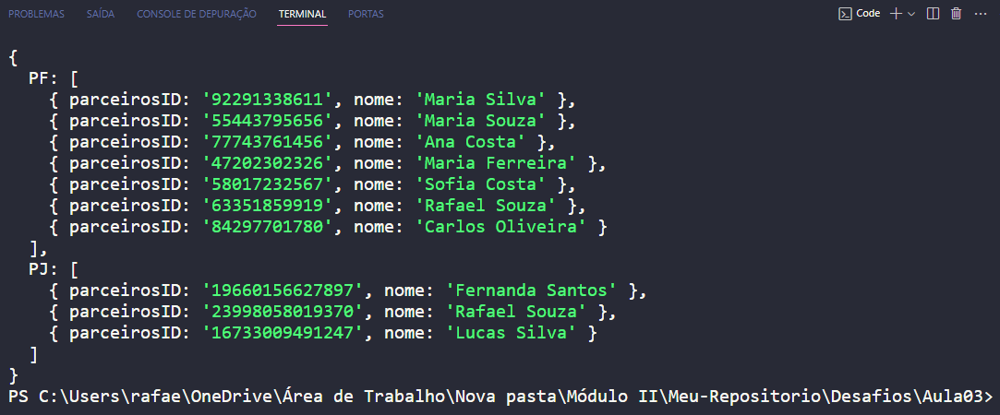

<a href="https://github.com/Rafael-GSousa/Ada_Tech-Modulo02/blob/main/Desafios/Aula03/index.js">Clique aqui</a> para visualizar o código

<b>A imagem abaixo mostra o resultado no terminal do VS Code</b>

