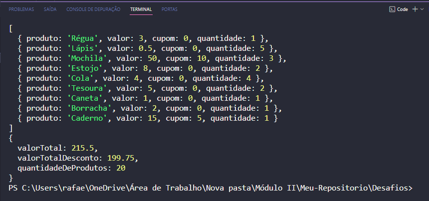

## Formatação de Dados - Recibo de Vendas

Em um sistema de vendas é emitido um recibo a cada venda, esse recibo está em formato `string` com a seguinte estrutura: 

    nome-do-produto1/valor33.5=cupom5;nome-do-produto2/valor4.99=cupom0;nome-do-produto3/valor10=cupom0;...

> As vendas são divididas por ; (ponto e virgula)

**Sendo**: 
- **nome-do-produto1** até a / (barra) o nome do produto
- **valor33.5** o valor do produto até o = (igual)
- **cupom5** a porcentagem de desconto do produto após o = (igual)

Precisamos formatar essa `string` para obter uma lista de objetos com a seguinte estrutura: 

    const listaDaVenda = [
        { 
            produto: 'Nome do produto formatado', // Nome do produto formatado com a primeira letra maiúscula 
            valor: 99, // Valor do produto
            cupom: 4, // Valor de desconto do produto em porcentagem, nesse caso seria 4%
            quantidade: 1, // A quantidade que esse produto aparece na string
        }
    ]

### Extra

Totalização da venda
Além da lista completa formatada da venda, seria interessante obter a totalização dessa venda para apresentar ao cliente final
Dado essa importância os seguintes dados devem ser apresentado em um objeto: 

    const totais = {
        valorTotal: 999, // Valor total da venda
        valorTotalDesconto: 999, // Valor total com desconto
        quantidadeDeProdutos: 999, // Quantidade de produtos na venda
    }

    const reciboDeVenda = 'régua/valor3=cupom0;lápis/valor0.5=cupom0;mochila/valor50=cupom10;estojo/valor8=cupom0;cola/valor4=cupom0;cola/valor4=cupom0;mochila/valor50=cupom10;lápis/valor0.5=cupom0;cola/valor4=cupom0;lápis/valor0.5=cupom0;mochila/valor50=cupom10;tesoura/valor5=cupom0;caneta/valor1=cupom0;cola/valor4=cupom0;estojo/valor8=cupom0;borracha/valor2=cupom0;caderno/valor15=cupom5;lápis/valor0.5=cupom0;lápis/valor0.5=cupom0;tesoura/valor5=cupom0;'

## Saída no terminal do VS Code

